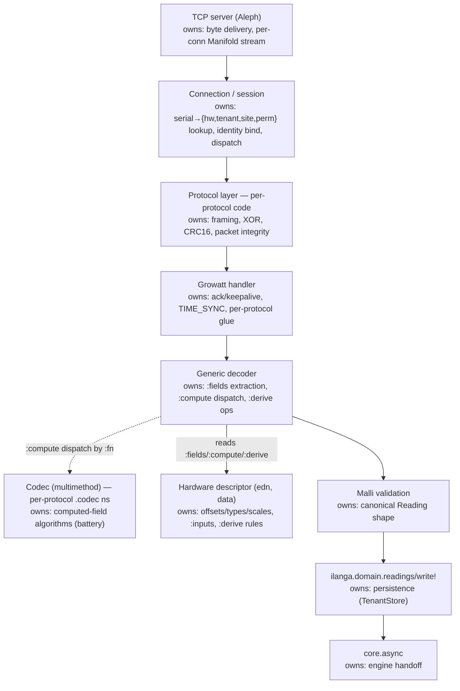

# 01 — Ingestion & Device Identity

**Status:** In progress — component responsibility, descriptor shape, and decode flow flushed. Field offsets are *not* enumerated here; the byte-level reference is the protocol doc, and the actual descriptor data is `resources/hardware/<model>.edn`.

## Purpose & scope
The path from a Growatt CubeWiFi TCP connection to a canonical `Reading` written to DuckDB and handed to the engine as `:new-reading`. Covers the TCP server, the Growatt wire protocol (framing, XOR obfuscation, CRC16), the hardware-mapping descriptor that turns a decoded payload into Reading fields, device registration/auth, and the core.async handoff to the pipeline. **Excludes** the pipeline dispatch and KPI computation (03) and the storage layout (02).

## Governing ADRs
- ADR-018 Ingestion TCP server & hardware mapping — Accepted
- ADR-020 Connection auth & device registration — Accepted
- ADR-033 Computed & derived field representation in hardware descriptors — Accepted

## Component responsibility

The decode path is a fixed pipeline of components, each owning one concern. Responsibilities are settled; only the codec/descriptor boundary was contested (resolved by ADR-033).

| Component | Scope | Owns | Collaborators |
|---|---|---|---|
| Aleph TCP server | protocol-agnostic | byte transport, per-connection Manifold stream | Connection / session |
| Connection / session | protocol-agnostic | serial→identity lookup, identity binding, dispatch | device registry (global config, ADR-020), `open-store`/`TenantStore` (ADR-026), protocol layer |
| Protocol layer (code) | per-protocol | framing, XOR, CRC16 — packet integrity | Growatt handler, generic decoder (hands decrypted payload) |
| Growatt handler | per-protocol | ack/keepalive, TIME_SYNC, per-protocol glue (no field knowledge) | connection stream, protocol layer, generic decoder (invokes) |
| Generic decoder | protocol-agnostic | `:fields` extraction, `:compute` dispatch, `:derive` ops | descriptor, codec fns, Malli validation, `write!` |
| Codec fns (multimethod) | per-protocol (`.codec` ns) | computed-field algorithms (battery power/current) | generic decoder (`defmulti` host), descriptor (`:inputs`) |
| Hardware descriptor (data) | per-hardware-id/model | offsets/types/scales, `:inputs`, `:derive` rules | generic decoder (read-only) |
| Malli validation | protocol-agnostic | canonical Reading shape | generic decoder (invokes), `Reading` schema (TDD-02) |
| `readings/write!` | domain | persistence (TenantStore) | `TenantStore`, `dead_letter_readings` (ADR-032), core.async (downstream put) |
| core.async | protocol-agnostic | engine handoff | `write!` (producer), engine (consumer, TDD-03) |

The handler knows nothing about fields — it shrinks to transport glue (ack/keepalive, TIME_SYNC). All field knowledge is in the descriptor + codec fns; the decoder is generic.

## Interfaces
- **Aleph TCP server:** accept → wait for announce (timeout ~10s) → serial lookup in device registry → bind `hardware-id`/`tenant-id`/`site-id`/`permission-id` to the Manifold stream → `open-store(tenant-id)` → `TenantStore` (ADR-026) → time-sync (`0x18`) → keepalive loop → normal packet processing. `site-id` is stamped onto each Reading this connection produces.
- **Hardware descriptor** (`resources/hardware/<model>.edn`) — pure data, three field classes (ADR-033): `:fields` (single-offset triples), `:compute` (codec-fn refs + `:inputs`), `:derive` (declarative ops over reading keys). Offsets/types/scales are authoritative in the protocol doc; the edn transcribes them.
- **Codec fns** — per-protocol namespaces (`ilanga.protocol.growatt.codec`), extending `defmulti compute-field` in the generic decoder via `defmethod`; `:fn` keyword = dispatch value. `defmethod` is registration (protocol ns self-contained); startup validates every descriptor `:fn` has a method.
- **Canonical `Reading`** map emitted on `:new-reading` (namespaced keys, units per ADR-019; derived fields like pv-total included per ADR-033).
- **core.async channel** — the single handoff point from ingestion to the engine; its capacity, backpressure, and overflow/drop behaviour are a deferred decision (see Open / deferred).

## Data structures / schemas
- **Growatt packet framing** (`[seq 2B BE][proto 2B][len 2B][unit 1B][type 1B][XOR payload][CRC16 2B BE]`), XOR key `b"Growatt"` for `proto 0x0006`, CRC16 Modbus poly `0xA001` init `0xFFFF`. Full byte-level detail in [`doc/protocol/growatt-cubewifi-data-payload.md`](../protocol/growatt-cubewifi-data-payload.md) — that file is the authoritative offset reference; offsets are *not* duplicated here.
- **Device registry entry** (`:device/serial`, `:device/hardware-id`, `:device/tenant-id`, `:device/site-id`, `:device/permission-id`, `:device/label`) — the one lookup that resolves the whole connection identity (ADR-020). `tenant-id` drives `open-store`; `site-id` stamps readings; parallel inverters share a `site-id`.
- **Hardware-mapping descriptor** — developer-authored only (no LLM catalog entry; explicit exception to ADR-005). Shape per ADR-033: `:fields`/`:compute`/`:derive`. The descriptor is the complete field map *and* the complete offset map for the model.
- **Field classification** (per ADR-033, not enumerated here):
  - `:fields` — single-offset extract (pv1/pv2 voltage/power/current, load, grid, ac voltages/current, frequency, temp, battery-voltage, energy-today, energy-total). Offsets in the protocol doc + edn.
  - `:compute` — multi-register, codec-computed: battery-power-w (231/241/243/230, overflow-aware), battery-current-a (243 − 241). Offsets in `:inputs`; algorithm in the codec fn; decode in the protocol doc's "Battery power & current decode".
  - `:derive` — declarative over decoded fields: pv-total-power-w = pv1 + pv2. Stored (ADR-033).
  - **Disproven / dropped:** `battery-soc-pct` at offset 107 — offset 107/108 is broken BMS noise, not a state-of-charge (see protocol doc / register-map note, 2026-06-24). Battery voltage (105) is the only usable charge proxy.

## Sequences / flows
- **Connection lifecycle** (ADR-020): no DuckDB write and no hardware-id dispatch before the serial lookup succeeds.
- **Decode pipeline:** raw bytes → de-frame → CRC check → XOR de-obfuscate → `:fields` extract → `:compute` dispatch (codec fns over payload) → `:derive` ops (over decoded Reading) → Malli validate canonical `Reading` → `write!` → put! on core.async → `:new-reading`. Order is fixed: `:fields` → `:compute` → `:derive` (ADR-033).
- **Forward-to-Growatt-cloud** (terminate-with-emulation) as a config toggle, default off.
- **New inverter model (same protocol)** = new descriptor file = deploy; no parsing-logic change. New protocol = new code (framing handler + `.codec` ns).

## Invariants & error modes
- **Unknown serial** → stream closed + logged with serial (the discovery path for adding a device); never silently accepted.
- **CRC/XOR/length failures** → stream closed, logged; no partial writes.
- **Announce timeout** → stream closed.
- **Protocol layer (framing/XOR/CRC) is per-protocol code, not in the descriptor** — the descriptor covers field extraction + computed/derived fields only.
- **Codec fn must exist:** at startup, every descriptor `:fn` key must resolve to a `defmethod` (`get-method` non-nil); a missing method is a boot error, not a first-packet error (ADR-033).
- **Backpressure:** the policy when the engine can't drain the ingestion channel (drop oldest? block?) is a deferred decision.

## Open / deferred
- core.async channel capacity, backpressure, and overflow/drop policy.
- Terminate-with-emulation forwarding: behaviour and config surface when enabled.
- `:derive` escape-hatch (an fn path for derived fields needing conditionals/lookups) — deferred until a real derived field needs it (ADR-033).