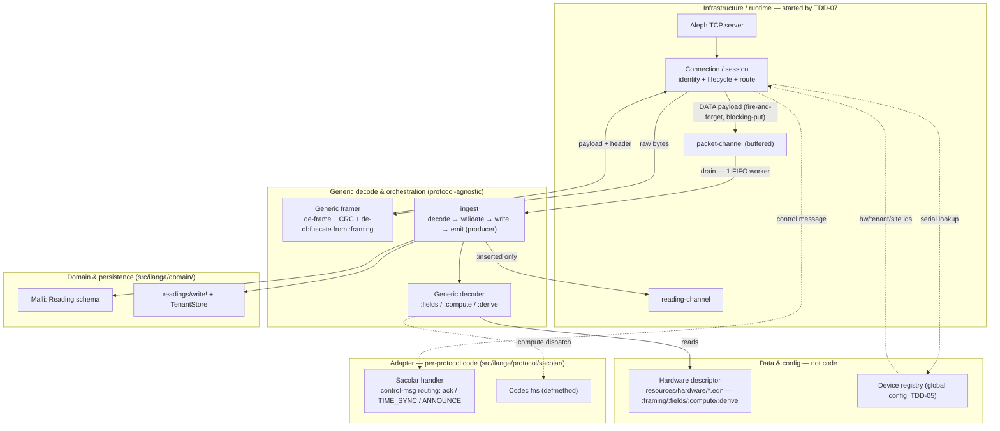

# 01 — Ingestion & Device Identity

**Status:** In progress — component responsibility, descriptor shape, and decode flow flushed. Field offsets are *not* enumerated here; the byte-level reference is the protocol doc, and the actual descriptor data is `resources/hardware/<model>.edn`.

## Purpose & scope
The path from a CubeWiFi TCP connection (Sacolar inverter) to a canonical `Reading` written to DuckDB and handed to the engine as `:new-reading`. Covers the TCP server, the CubeWiFi wire protocol (Growatt-family: framing, XOR obfuscation, CRC16), the hardware-mapping descriptor that turns a decoded payload into Reading fields, device registration/auth, and the core.async handoff to the pipeline. **Excludes** the pipeline dispatch and KPI computation (03) and the storage layout (02).

## Governing ADRs
- ADR-018 Ingestion TCP server & hardware mapping — Accepted
- ADR-020 Connection auth & device registration — Accepted
- ADR-033 Computed & derived field representation in hardware descriptors — Accepted
- ADR-034 Framing descriptor vocabulary & data-driven framer — Accepted

## Component responsibility

The decode path is a fixed pipeline of components, each owning one concern — stated as **responsibility** (accountability + guarantee), not just mechanism. Responsibilities are settled; the codec/descriptor boundary was resolved by ADR-033 and the framer/ingest split is settled here.

| Component | Scope | Responsibility (accountable for / guarantees) | Collaborators |
|---|---|---|---|
| Aleph TCP server | protocol-agnostic | Byte delivery per connection; per-connection isolation + backpressure. Not accountable for packet meaning. | Connection / session |
| Connection / session | protocol-agnostic | The connection: identity binding + per-packet recovery/routing. Identity bound before any packet routed; control messages handled on-stream; DATA handed to ingest; unknown serials rejected. | device registry (ADR-020), `open-store`/`TenantStore` (ADR-026), generic framer, Sacolar handler, packet-channel |
| Generic framer | protocol-agnostic | Packet recovery. Only CRC-valid, de-obfuscated payloads emerge; data-driven from `:framing`; rejects malformed packets. | connection (driver), descriptor (`:framing`) |
| Sacolar handler | per-protocol | Control-message handling. ack/keepalive + UTC TIME_SYNC + ANNOUNCE serial extraction; knows nothing about fields/data. (CubeWiFi message types are Growatt-family-shared; whether this handler promotes to a family handler is deferred until a 2nd CubeWiFi-family device lands.) | connection stream, device registry |
| ingest | protocol-agnostic | Telemetry→fact→signal. field-decode → Malli → idempotent `write!` → emit on `:inserted` only; all error paths dead-lettered; the channel producer. | generic decoder, Malli, `write!`, packet-channel (drains), reading-channel (puts) |
| Generic decoder | protocol-agnostic | Producing the canonical Reading. Carries every key the descriptor declares; the only place field extraction/computation; no vendor/protocol knowledge. | ingest (caller), descriptor, codec fns |
| Codec fns (multimethod) | per-protocol (`.codec` ns) | Computed-field correctness. Pure, defmethod-registered (fail-closed), decode matches the protocol doc. | generic decoder (`defmulti` host), descriptor (`:inputs`) |
| Hardware descriptor (data) | per-hardware-id/model | Declaring a model's complete framing+field+offset map. Pure data, no logic; the device's truth (protocol doc is the byte authority). | generic framer (`:framing`), generic decoder (`:fields`/`:compute`/`:derive`) — both read-only |
| Malli validation | protocol-agnostic | The canonical-shape gate. No Reading persists unless it conforms. | ingest (invokes), `Reading` schema (TDD-02) |
| `readings/write!` | domain | Append-only idempotent persistence. No duplicate facts; replays no-op; differing identity dead-lettered; never UPDATE/DELETE. | `TenantStore`, `dead_letter_readings` (ADR-032), ingest (caller) |
| core.async (channels) | protocol-agnostic | The two decoupling seams. packet-channel decouples read from process (buffered, blocking-put never drops); reading-channel decouples ingest from engine. | connection/ingest (producers), ingest/engine (consumers) |

Framing is data-driven (generic framer from `:framing`), not per-protocol code; the handler's per-protocol code is control-message routing only. **ingest** owns the telemetry→fact→signal path and is the sole channel producer, emitting only on `:inserted`. The decoder stays pure; `write!` stays pure-persist.

## Interfaces
- **Aleph TCP server:** accept → wait for announce (timeout ~10s) → serial lookup in device registry → bind `hardware-id`/`tenant-id`/`site-id`/`permission-id` to the Manifold stream → `open-store(tenant-id)` → `TenantStore` (ADR-026) → time-sync (`0x18`) → keepalive loop → normal packet processing. `site-id` is stamped onto each Reading this connection produces.
- **Hardware descriptor** (`resources/hardware/<model>.edn`) — pure data: `:framing` (drives the generic framer), plus three field classes (ADR-033): `:fields` (single-offset triples), `:compute` (codec-fn refs + `:inputs`), `:derive` (declarative ops over reading keys). Offsets/types/scales are authoritative in the protocol doc; the edn transcribes them.
- **Codec fns** — per-protocol namespaces (`ilanga.protocol.sacolar.codec`), extending `defmulti compute-field` in the generic decoder via `defmethod`; `:fn` keyword = dispatch value. `defmethod` is registration (protocol ns self-contained); startup validates every descriptor `:fn` has a method.
- **Canonical `Reading`** map emitted on `:new-reading` (namespaced keys, units per ADR-019; derived fields like pv-total included per ADR-033).
- **core.async channels — two seams:** packet-channel (connection→ingest, DATA payloads, buffered, blocking-put) and reading-channel (ingest→engine, Readings). The reading-channel's capacity/backpressure/overflow policy is a deferred decision (see Open / deferred).

## Data structures / schemas
- **CubeWiFi packet framing** (`[seq 2B BE][proto 2B][len 2B][unit 1B][type 1B][XOR payload][CRC16 2B BE]`), XOR key `b"Growatt"` for `proto 0x0006`, CRC16 Modbus poly `0xA001` init `0xFFFF`. Full byte-level detail in [`doc/protocol/sacolar-cubewifi-data-payload.md`](../protocol/sacolar-cubewifi-data-payload.md) — that file is the authoritative offset reference; offsets are *not* duplicated here. The descriptor's `:framing` block (sequential header widths, `:counts` length semantics, crc covers, obfuscation trigger) drives the generic framer; its vocabulary is **ADR-034**.
- **Device registry entry** (`:device/serial`, `:device/hardware-id`, `:device/tenant-id`, `:device/site-id`, `:device/permission-id`, `:device/label`) — the one lookup that resolves the whole connection identity (ADR-020). `tenant-id` drives `open-store`; `site-id` stamps readings; parallel inverters share a `site-id`.
- **Hardware-mapping descriptor** — developer-authored only (no LLM catalog entry; explicit exception to ADR-005). Covers `:framing` + `:fields`/`:compute`/`:derive` (ADR-033). The descriptor is the complete framing+field map *and* the complete offset map for the model.
- **Field classification** (per ADR-033, not enumerated here):
  - `:fields` — single-offset extract (pv1/pv2 voltage/power/current, load, grid, ac voltages/current, frequency, temp, battery-voltage, energy-today, energy-total). Offsets in the protocol doc + edn.
  - `:compute` — multi-register, codec-computed: battery-power-w (231/241/243/230, overflow-aware), battery-current-a (243 − 241). Offsets in `:inputs`; algorithm in the codec fn; decode in the protocol doc's "Battery power & current decode".
  - `:derive` — declarative over decoded fields: pv-total-power-w = pv1 + pv2. Stored (ADR-033).
  - **Disproven / dropped:** `battery-soc-pct` at offset 107 — offset 107/108 is broken BMS noise, not a state-of-charge (see protocol doc / register-map note, 2026-06-24). Battery voltage (105) is the only usable charge proxy.

## Sequences / flows
- **Connection lifecycle** (ADR-020): no DuckDB write and no hardware-id dispatch before the serial lookup succeeds.
- **Decode pipeline (structural fire-and-forget):** the connection drives the generic **framer** (de-frame → CRC → de-obfuscate, from `:framing`) and **routes** — control messages to the handler inline, DATA payloads `>!!` onto a buffered **packet-channel** (blocking-put, never drop). A single supervised FIFO worker drains the packet-channel into **ingest**, which runs field-decode (`:fields` → `:compute` → `:derive`) → Malli validate → `write!` → `put!` on the **reading-channel** *only on `:inserted`* (replays `:noop` and dead-letters are silent — one fact, one `:new-reading`). Two channels: packet-channel (connection→ingest) decouples cheap read+de-frame from the slow DuckDB write and absorbs BUFFERED_DATA reconnect bursts; reading-channel (ingest→engine) decouples ingestion from the pipeline.
- **Forward-to-vendor-cloud** (pvbutler; terminate-with-emulation) as a config toggle, default off.
- **New inverter model (same protocol)** = new descriptor file = deploy; no parsing-logic change (framing is data-driven, no framing code). New protocol = new code (routing handler + `.codec` ns) unless its framing is `:framing`-expressible.

## Invariants & error modes
- **Unknown serial** → stream closed + logged with serial (the discovery path for adding a device); never silently accepted.
- **CRC/XOR/length failures** → stream closed, logged; no partial writes.
- **Announce timeout** → stream closed.
- **Framing is data-driven, not per-protocol code** — the descriptor's `:framing` block drives a generic framer at the connection; per-protocol framing code is the escape-hatch for protocols the `:framing` vocabulary can't capture (mirroring `:compute`). The handler's per-protocol code is control-message routing, not framing.
- **Codec fn must exist:** at startup, every descriptor `:fn` key must resolve to a `defmethod` (`get-method` non-nil); a missing method is a boot error, not a first-packet error (ADR-033).
- **Backpressure:** the packet-channel uses blocking-put (sustained overload backpressures the device; bursts absorbed by the buffer — never drops a fact). The reading-channel's backpressure/overflow policy (drop oldest? block?) is a deferred decision.

## Open / deferred
- reading-channel capacity, backpressure, and overflow/drop policy (packet-channel is settled: buffered, blocking-put, never drop).
- Terminate-with-emulation forwarding: behaviour and config surface when enabled.
- `:derive` escape-hatch (an fn path for derived fields needing conditionals/lookups) — deferred until a real derived field needs it (ADR-033).