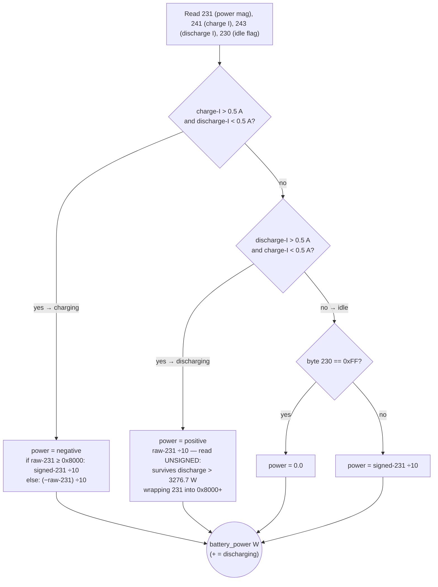

# Sacolar inverter — CubeWiFi DATA Payload Reference

The device on this site is a **Sacolar** inverter, reached through a **CubeWiFi** datalogger. Sacolar (Shenzhen Sacolar New Energy) is a wholly-owned subsidiary of Growatt; it reuses the same CubeWiFi datalogger hardware and the same cloud architecture (Sacolar's cloud is `server.pvbutler.com`, surfaced by the *pvbutler* app). The **wire framing is literally the Growatt CubeWiFi protocol** — identical header, identical `b"Growatt"` XOR key, identical CRC16-Modbus, identical message types and ACK shape. The **only thing that differs is the DATA payload field-offset map** decoded below. So: *protocol = Growatt-family CubeWiFi (shared); inverter = Sacolar; payload layout = Sacolar-specific.* (Confirmed via grott: grott has no Sacolar/Sunrino profile, so it silently drops these records — `novalidrec`.)

All offsets, types, scales, and sign conventions in this document are confirmed against live pvbutler readings and an APD-family Modbus register map (V1.2, sunvec.es) — the register map that the CubeWiFi repackages; it names neither brand. This is the authoritative reference for the `ilanga.protocol.decoder` implementation and the ADR-018 hardware descriptor. Battery power (231) and battery current (241/243) are **codec-computed** from multiple registers with overflow handling via the descriptor's `:compute` class (ADR-033) — not single-offset fields; see [Battery power & current decode](#battery-power--current-decode).

---

## Packet framing

```
[seq 2B BE][proto 2B BE][length 2B BE][unit 1B][type 1B][XOR payload][CRC16 2B BE]
```

- `proto == 0x0006` → payload is XOR-obfuscated with repeating key `b"Growatt"` (7 bytes)
- CRC16 Modbus: poly `0xA001`, init `0xFFFF`, computed over `header + encrypted payload` (i.e. before XOR decrypt), stored big-endian
- `length` field = `unit(1) + type(1) + payload_len`, so `payload_len = length - 2`

## Message types

| Direction | Type | Name |
|---|---|---|
| Device → Server | `0x16` | PING |
| Device → Server | `0x19` | IDENTIFY response |
| Device → Server | `0x03` | ANNOUNCE |
| Device → Server | `0x04` | DATA (live telemetry) |
| Device → Server | `0x50` | BUFFERED_DATA (historical, same layout as DATA) |
| Device → Server | `0x18` | TIME_SYNC_RSP |
| Server → Device | `0x16` | PING echo |
| Server → Device | `0x19` | READ_REGISTERS request |
| Server → Device | `0x03` | ANNOUNCE_ACK |
| Server → Device | `0x04` | DATA_ACK |
| Server → Device | `0x50` | BUFFERED_DATA_ACK |
| Server → Device | `0x18` | TIME_SYNC |

ACK format (server → device): echo seq/unit/type, payload = single `0x00` byte (XOR-encrypted).

---

## DATA / BUFFERED_DATA payload (349 bytes, decrypted)

All multi-byte integers are big-endian. All offsets are into the **decrypted** payload.

### Inverter identification (bytes 0–59)

Bytes 0–9 contain the inverter serial number as ASCII, zero-padded. Bytes 10–59 contain a secondary identifier (datalogger serial). These are present in ANNOUNCE too; in DATA they can be used to confirm the source.

### Inverter real-time clock (bytes 60–65)

| Bytes | Field | Encoding |
|---|---|---|
| 60 | Year offset | `+ 2000`, e.g. `0x1A` = 2026 |
| 61 | Month | 1–12 |
| 62 | Day | 1–31 |
| 63 | Hour | 0–23 |
| 64 | Minute | 0–59 |
| 65 | Second | 0–59 |

The inverter has no independent time source. It sets its clock to exactly the timestamp the server sends in `0x18` TIME_SYNC — no NTP, no GPS, no drift correction. Whatever the server sends is what the inverter believes. This makes TIME_SYNC the single point of authority for all `inverter_timestamp` values in the database.

The server sends **UTC**. The inverter clock therefore runs in UTC; the `inverter_timestamp` decoded from bytes 60–65 is UTC. Timezone conversion to local time (UTC+2) is the application's responsibility at display time. A wrong timezone in TIME_SYNC propagates to every DATA reading until the next reconnect.

---

## Confirmed field offsets

| Field | Offset | Type | Scale | Units | Notes |
|---|---|---|---|---|---|
| PV1 voltage | 73 | uint16 BE | ÷10 | V | Confirmed vs pvbutler `vPv1` |
| PV2 voltage | 75 | uint16 BE | ÷10 | V | Confirmed vs pvbutler `vPv2` |
| PV1 power | 79 | uint16 BE | ÷10 | W | Confirmed vs pvbutler `ppv1` |
| PV2 power | 83 | uint16 BE | ÷10 | W | Confirmed vs pvbutler `ppv2` |
| PV1 current | 85 | uint16 BE | ÷10 | A | Confirmed vs pvbutler `iPv1` |
| PV2 current | 87 | uint16 BE | ÷10 | A | Confirmed vs pvbutler `iPv2` |
| Load power | 91 | uint16 BE | ÷10 | W | Confirmed vs pvbutler `loadPower` |
| AC apparent power | 95 | uint16 BE | ÷10 | VA | Confirmed vs pvbutler `rateVA` |
| Battery voltage | 105 | uint16 BE | ÷100 | V | Confirmed vs pvbutler `vBat`; Modbus register `0x2006` is ÷10, CubeWiFi repackages at ÷100 |
| Battery SOC | 107 | uint16 BE | ×1 | % | System SOC; matches pvbutler `capacity`; steps 25/50/75/100 in captures |
| DC bus voltage | 109 | uint16 BE | ÷10 | V | ~455 V daytime, ~388 V at night; not a PV string voltage |
| AC input voltage L1 | 111 | uint16 BE | ÷10 | V | Confirmed vs pvbutler `vAcInput`; Modbus `0x1001` ÷10 V |
| AC output voltage L1 | 115 | uint16 BE | ÷10 | V | Confirmed vs pvbutler `vAcOutput` |
| Inverter temperature | 121 | uint16 BE | ÷10 | °C | Confirmed vs real reading; Modbus `0x101C` is ÷1, CubeWiFi repackages at ÷10 |
| Grid import power | 145 | **uint16 BE** | ÷10 | W | Confirmed vs pvbutler `gridPower`; always ≥ 0; represents power drawn *from* grid only; grid export is not represented in this field |
| Battery SOC (pack) | 162 | uint8 | ×1 | % | One physical battery pack BMS SOC; stable ~45% in captures |
| Today energy | 173 | **uint16 BE** | ÷10 | kWh | Read as u16 at 173–174; byte 173 is 0x00 in all winter captures (≤ 25.5 kWh); assumed u16 to prevent silent truncation on summer days where 5.5 kWp can exceed 25.5 kWh — **re-verify on a high-yield summer capture** |
| Total energy | 175 | uint32 BE | ÷10 | kWh | Confirmed vs pvbutler; 4 bytes; confirmed at 9283.1 kWh |
| AC input current | 262 | uint16 BE | ÷100 | A | Confirmed ~3.36 A; Modbus `0x1002` ÷100 A |
| Grid frequency | 267 | uint16 BE | ÷100 | Hz | ~49.99 Hz |
| Battery idle flag | 230 | uint8 | ×1 | flag | `0xFF` = no battery current flowing (idle); used by the power decode to force 0 W |
| Battery power | 231 | int16 BE | ÷10 | W | Signed (**+ = discharging, − = charging**), but the **sign and overflow are resolved by the codec fn** from the direction registers 241/243, not bit 15 of 231. Codec-computed (`:compute`, ADR-033); see [Battery power & current decode](#battery-power--current-decode) |
| Battery current (charge) | 241 | uint16 BE | ÷10 | A | Charge-direction magnitude only; net current = `discharge(243) − charge(241)` |
| Battery current (discharge) | 243 | uint16 BE | ÷10 | A | Discharge-direction magnitude only; net current = `discharge(243) − charge(241)` |

### PV total power

There is no `pv_total` field in the packet. Total PV power is computed as `pv1_power + pv2_power`. This matches pvbutler `panelPower`.

### Battery power & current decode

`battery_power` (offset 231) and `battery_current` are **codec-computed, not single-offset fields** (ADR-033). Offset 231 alone is ambiguous: its sign bit does not reliably indicate direction, and it **overflows** on large discharge. The codec fn resolves both from four registers:

| Register | Offset | Meaning |
|---|---|---|
| power magnitude | 231 | u16/s16 — ambiguous on overflow (see below) |
| charge-direction current | 241 | u16, ÷10, A (magnitude, charge only) |
| discharge-direction current | 243 | u16, ÷10, A (magnitude, discharge only) |
| idle flag | 230 | u8 — `0xFF` = no current flowing |

**Battery current** (signed, + = discharging): `I_bat = discharge(243) − charge(241)`, rounded to 0.01 A. The two registers are direction-specific magnitudes; their difference is the signed net current, and its sign matches `battery_power`.

**Battery power** (signed, + = discharging): resolved by direction, with a **0.5 A hysteresis** to avoid misclassifying idle noise — charge-current (241) reads ~0 at idle, so a bare `charge == 0` test would fabricate a large "discharge" from idle noise:



The overflow case is why 231 cannot be a plain signed int16: a discharge above 3276.7 W sets bit 15 of 231, which a signed read interprets as a large **negative** number. Reading 231 **unsigned** while the direction registers say "discharging" yields the correct positive power. Conversely, when the inverter reports charge as a positive magnitude (raw-231 `< 0x8000` during charge), the handler negates it.

This matches pvbutler's `batPower` convention (positive = discharging). The legacy `battery_power_phys` field (`= −battery_power`) inverts this — avoid it for new KPIs; use `battery_power` directly.

> Both fields are codec-computed (ADR-033). They are **not** expressible as `{:offset :type :scale}` descriptor entries; the hardware descriptor references a codec fn via `:compute` in `ilanga.protocol.sacolar.codec` for them (ADR-018/033).

---

## Known / suspect fields

These are captured but not yet fully confirmed. Do not use in production KPIs without further verification.

| Field | Offset | Type | Scale | Notes |
|---|---|---|---|---|
| Battery current (pack) | 61 | uint16 BE | ÷100 | A | Confirmed against one inverter screen reading but does not track total battery power; may be one pack/string |
| Battery power (alternate) | 270 | uint16 BE | ÷10 | W | ~770 W; not equal to `batPower` at offset 231; may be one pack or inverter DC-link power |
| Unknown (198) | 198 | uint8 | ×1 | ? | Rises while battery is discharging; not SOC |
| Unknown (214) | 214 | uint16 BE | ÷10 | ? | Non-zero at night; not a PV field |
| Unknown (218) | 218 | uint16 BE | ÷10 | ? | Non-zero at night; not a PV field |

---

## Handshake sequence

```
Device  → Server : PING (0x16)
Server  → Device : READ_REGISTERS (0x19)  [identify request, sent once]
Server  → Device : PING echo (0x16)
Device  → Server : IDENTIFY response (0x19)  [content not yet decoded]
Device  → Server : ANNOUNCE (0x03)          [serial in payload bytes 0–9]
Server  → Device : ANNOUNCE_ACK (0x03)
Server  → Device : TIME_SYNC (0x18)
Device  → Server : TIME_SYNC_RSP (0x18)
Device  → Server : DATA (0x04)             [349-byte payload, every ~60 s]
Server  → Device : DATA_ACK (0x04)
```

BUFFERED_DATA (0x50) follows the same layout as DATA. It is sent by the device to replay readings stored in flash from periods when the device was disconnected. The `inverter_timestamp` field (bytes 60–65) carries the original reading time; the server's `captured_at` timestamp reflects when the buffered data was received, not when the reading was taken.

## TIME_SYNC payload format

```
[serial 10B][zeros 21B][0x1F][0x00][len 1B][ASCII timestamp len B]
```

ASCII timestamp format: `YYYY-MM-DD HH:MM:SS` (19 bytes, so `len = 0x13`). The timestamp is **UTC**. The inverter clock runs in UTC; timezone conversion happens in the application at display time.

## Server-initiated READ_REGISTERS (0x19) payload

```
[serial 10B][zeros 21B][0x04][0x00][0x15]
```

Sub-command reads 21 bytes from register `0x0004`. The device's IDENTIFY response to this has not yet been decoded.

---

## External references

- [Growatt Inverter Communications Protocol](https://www.ietfng.org/nwf/misc/growatt-protocol.html) — packet framing, XOR obfuscation, handshake. Documents the CubeWiFi wire protocol (Growatt-family, shared unchanged by the Sacolar datalogger).
- [APD-family Modbus register map V1.2](https://sunvec.es/wp-content/uploads/2023/05/Modbus-Protocol-V1.2-2.pdf) (sunvec.es) — the register map the CubeWiFi repackages; confirms scales for battery voltage/current/power, AC voltage/current, load power, temperature. Names neither brand (it is the APD inverter family map).

---

## Verification method

To re-verify or extend this field map, run `compare_pvbutler.py` against a fresh capture while the inverter is in a known state (e.g. high PV generation, or full battery charge). The pvbutler `getSystemStatus` response provides ground truth for all confirmed fields.
